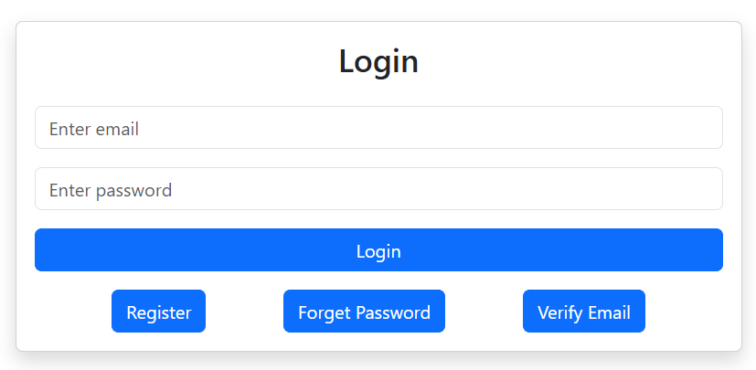

# 👥 User Management System

A **full-stack User Management System** built using **HTML, CSS, Bootstrap, Node.js, Express.js, MongoDB, and EJS**.  
The project provides secure user authentication, email verification, password recovery, and an admin dashboard to manage users efficiently.

---

## 📌 Project Overview

This application contains two main modules:
- **User Module**
- **Admin Module**

Users can register, verify their email, log in, and manage their profile.  
Admins can view, add, and edit users from a centralized dashboard.

---

## 🚀 Features

### 👤 User Module
- User registration with email verification
- Secure login after verification
- User home page with personal details
- Edit user profile
- Forgot password functionality via email

### 🛡 Admin Module
- Admin registration and login
- Admin home page with profile details
- Dashboard to view all users
- Displays user information:
  - Username
  - Email
  - Profile details
- Admin can add new users
- Admin can edit existing users

---

## 🛠 Tech Stack

### Frontend
- HTML
- CSS
- Bootstrap

### Backend
- Node.js
- Express.js

### Database
- MongoDB

### View Engine
- EJS (Embedded JavaScript Templates)

### Other Tools
- Nodemailer (Email verification & password reset)
- JWT / Sessions (Authentication)

---

## 📸 Screenshots

Screenshots are available in the `screenshots/` folder.

```md



