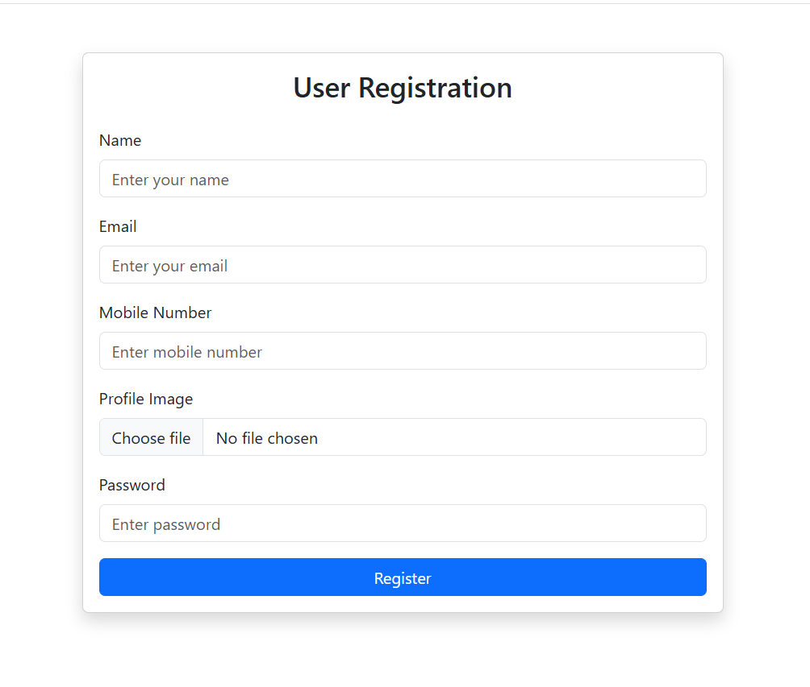

## 📌 Projects
### 🔹 User Management System
Full-stack web application to manage tools, users, and shops with role-based access.

🔗 **Repository:** https://github.com/abdurahman715/User-Management-System  

**Key Features**
- Admin can manage users and shops
- Shop owners can add/update tools
- Users can rent, buy, or repair tools
- JWT-based authentication
## Screenshots

