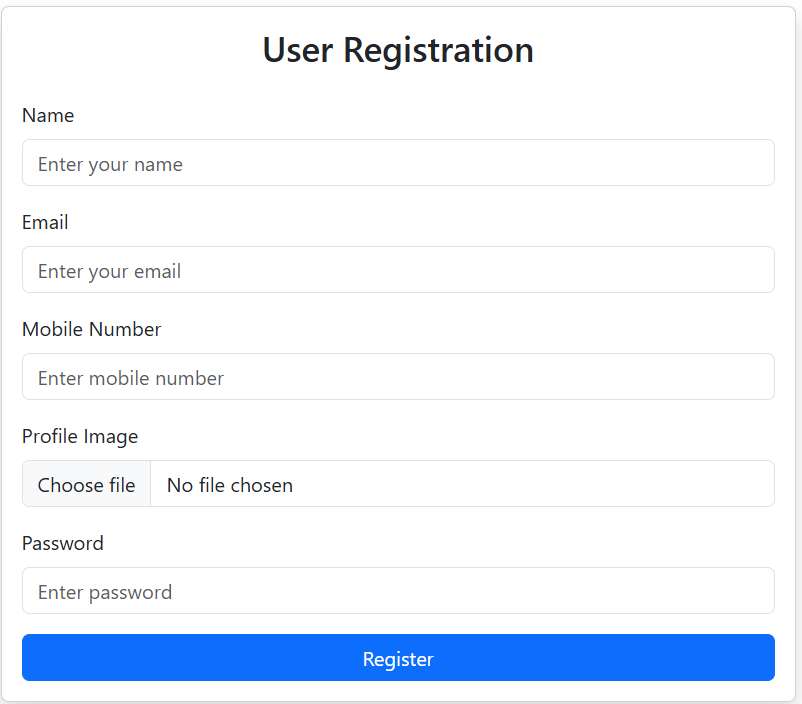

# 👥 User Management System

A **full-stack User Management System** built using **HTML, CSS, Bootstrap, Node.js, Express.js, MongoDB, and EJS**.  
The project provides secure user authentication, email verification, password recovery, and an admin dashboard to manage users efficiently.

---

## 📌 Project Overview

This application contains two main modules:
- **User Module**
- **Admin Module**

Users can register, verify their email, log in, and manage their profile.  
Admins can view, add, and edit users from a centralized dashboard.

---

## 🚀 Features

### 👤 User Module
- User registration with email verification
- Secure login after verification
- User home page with personal details
- Edit user profile
- Forgot password functionality via email

### 🛡 Admin Module
- Admin registration and login
- Admin home page with profile details
- Dashboard to view all users
- Displays user information:
  - Username
  - Email
  - Profile details
- Admin can add new users
- Admin can edit existing users

---
## 🛠 Tech Stack

<table>
  <tr>
    <th>Layer</th>
    <th>Technologies Used</th>
  </tr>
  <tr>
    <td>Frontend</td>
    <td>HTML, CSS, Bootstrap</td>
  </tr>
  <tr>
    <td>Backend</td>
    <td>Node.js, Express.js</td>
  </tr>
  <tr>
    <td>Database</td>
    <td>MongoDB</td>
  </tr>
  <tr>
    <td>View Engine</td>
    <td>EJS</td>
  </tr>
  <tr>
    <td>Authentication</td>
    <td>JWT / Sessions</td>
  </tr>
  <tr>
    <td>Email Service</td>
    <td>Nodemailer</td>
  </tr>
</table>

## 📸 Screenshots

<table>
  <tr>
    <td align="center">
      <b>User Registration</b> 
      
    </td>
    <td align="center">
      <b>User Login</b> 
      
    </td>
  </tr>
</table>
